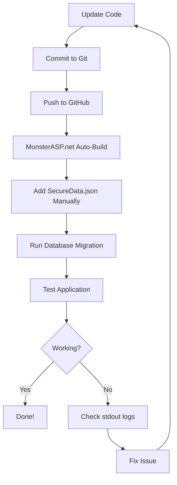

# FintechAPI - Deployment Documentation

## 📚 Documentation Overview

This repository contains comprehensive deployment guides for the FintechAPI payment orchestration system.

---

## 🚀 Quick Start - GitHub to MonsterASP.net

**Follow these steps in order:**

1. **Read**: `GITHUB_DEPLOY_CHECKLIST.md` ← Start here!
2. **Run Database Migration** (CRITICAL!):
   ```bash
   dotnet ef database update --project Infrastructure --startup-project Web
   ```
3. **Push to GitHub**:
   ```bash
   git push origin main
   ```
4. **Add SecureData.json** manually to MonsterASP.net
5. **Check logs** in `logs/stdout_*.log`

---

## 📖 Available Guides

### 1. GITHUB_DEPLOY_CHECKLIST.md
**Quick checklist for GitHub deployment**
- Pre-deployment steps
- MonsterASP.net configuration
- Testing procedures
- ⏱️ Read time: 5 minutes

### 2. GITHUB_DEPLOYMENT_GUIDE.md
**Complete GitHub deployment guide**
- Detailed step-by-step instructions
- Security best practices
- Continuous deployment workflow
- Troubleshooting common issues
- ⏱️ Read time: 15 minutes

### 3. MONSTERASP_QUICK_FIX.md
**Troubleshooting your current 403 error**
- Immediate actions to take
- Most likely causes
- Step-by-step fix procedure
- ⏱️ Read time: 10 minutes

### 4. DEPLOYMENT_TROUBLESHOOTING.md
**Comprehensive troubleshooting guide**
- All possible deployment issues
- Detailed solutions
- Configuration examples
- ⏱️ Read time: 20 minutes

### 5. IMPLEMENTATION_COMPLETE.md
**Technical implementation details**
- All features implemented
- Architecture overview
- API endpoints
- Database schema
- ⏱️ Read time: 15 minutes

### 6. DEPLOYMENT_GUIDE.md
**Original deployment guide**
- Manual deployment steps
- Configuration templates
- Testing procedures
- ⏱️ Read time: 15 minutes

---

## 🔥 Most Common Issue: Database Migration

**90% of deployment failures are caused by not running the database migration!**

### The Problem
The new payment orchestration features added 5 new database tables:
- AuditLogs
- ReconciliationReports
- SecretRotationHistory
- SecurityAuditLogs
- TransactionMismatches

If these tables don't exist, the app crashes on startup with a 403 error.

### The Solution
Run this command BEFORE deploying:

```bash
dotnet ef database update --project Infrastructure --startup-project Web --connection "Server=db42073.public.databaseasp.net;Database=db42073;User Id=db42073;Password=9h+KT7d?2-Xx;Encrypt=True;TrustServerCertificate=True;"
```

Or generate and run the SQL script manually:

```bash
dotnet ef migrations script --project Infrastructure --startup-project Web --idempotent --output migration.sql
```

---

## 🔐 Security Checklist

### Files That MUST NOT Be in GitHub:
- ❌ `SecureData.json`
- ❌ `appsettings.Production.json` (if it has secrets)
- ❌ Any file with passwords or API keys

### Files That MUST Be in GitHub:
- ✅ `web.config`
- ✅ All `.csproj` files
- ✅ All source code (`.cs` files)
- ✅ Migration files
- ✅ `appsettings.json` (without secrets)

### Verify:
```bash
# This should return NOTHING (SecureData.json should not be in Git)
git ls-files | grep SecureData.json

# This should return the file (web.config should be in Git)
git ls-files | grep web.config
```

---

## 🎯 Deployment Workflow

### For GitHub Deployment:



### Critical Steps:
1. ✅ Code in GitHub (without secrets)
2. ✅ SecureData.json added manually
3. ✅ Database migration run
4. ✅ Application pool configured
5. ✅ Logs folder created

---

## 🐛 Troubleshooting Quick Reference

| Error | Cause | Solution |
|-------|-------|----------|
| 403 Forbidden | App crashed on startup | Check `logs/stdout_*.log` |
| Invalid object name 'AuditLogs' | Migration not run | Run `dotnet ef database update` |
| Value cannot be null (Parameter 's') | Missing JWT key | Add to SecureData.json |
| Could not load assembly | Missing DLLs | Deploy self-contained |
| Network-related error | DB connection failed | Check connection string |

### Where to Find Errors:
1. **Build errors**: MonsterASP.net build log
2. **Runtime errors**: `logs/stdout_*.log` on server
3. **Database errors**: SQL Server logs

---

## 📋 Pre-Deployment Checklist

Before pushing to production:

- [ ] All tests pass locally
- [ ] Database migration created (if schema changed)
- [ ] No secrets in code (check with `git grep -i password`)
- [ ] `web.config` exists and is correct
- [ ] `.gitignore` excludes `SecureData.json`
- [ ] Build succeeds: `dotnet build -c Release`
- [ ] Publish succeeds: `dotnet publish -c Release`
- [ ] Database migration tested locally

---

## 🎓 Learning Path

### If You're New to Deployment:
1. Start with `GITHUB_DEPLOY_CHECKLIST.md`
2. Follow each step carefully
3. Check logs after each step
4. If issues occur, read `MONSTERASP_QUICK_FIX.md`

### If You're Experienced:
1. Skim `GITHUB_DEPLOY_CHECKLIST.md`
2. Run database migration
3. Push to GitHub
4. Add SecureData.json
5. Done!

### If Deployment Failed:
1. Check `logs/stdout_*.log` FIRST
2. Read `MONSTERASP_QUICK_FIX.md`
3. Apply the fix for your specific error
4. If still stuck, read `DEPLOYMENT_TROUBLESHOOTING.md`

---

## 🔧 Useful Commands

### Database Migration:
```bash
# Run migration
dotnet ef database update --project Infrastructure --startup-project Web

# Generate SQL script
dotnet ef migrations script --project Infrastructure --startup-project Web --output migration.sql

# List migrations
dotnet ef migrations list --project Infrastructure --startup-project Web
```

### Build and Publish:
```bash
# Build
dotnet build -c Release

# Publish (self-contained)
dotnet publish Web/Web.csproj -c Release -r win-x64 --self-contained true -o ./publish

# Publish (framework-dependent)
dotnet publish Web/Web.csproj -c Release -o ./publish
```

### Git Commands:
```bash
# Check what's in repository
git ls-files

# Remove secret file from Git
git rm --cached Web/SecureData.json

# Push to trigger deployment
git push origin main

# Revert last commit
git revert HEAD
git push origin main
```

---

## 📞 Getting Help

### If Deployment Fails:

1. **Check stdout logs** in `logs` folder (most important!)
2. **Read the appropriate guide** based on your issue
3. **Try the suggested solutions**
4. **Contact support** with:
   - Contents of `logs/stdout_*.log`
   - MonsterASP.net build log
   - Screenshot of error
   - Steps you've already tried

### Support Resources:
- MonsterASP.net Support: support@monsterasp.net
- Documentation: All guides in this repository
- Logs: `logs/stdout_*.log` on server

---

## ✅ Success Indicators

Your deployment is successful when:

- ✅ Site loads without 403/500 errors
- ✅ Swagger UI accessible at `/swagger`
- ✅ API endpoints respond correctly
- ✅ Background services running (check logs for "started" messages)
- ✅ No errors in `logs/stdout_*.log`
- ✅ Database tables exist and are populated
- ✅ Payment provider integrations work

---

## 🎉 What's New in This Deployment

This deployment includes the complete payment orchestration system:

### New Features:
- ✅ Multi-provider payment support (Paystack, Flutterwave, Remita)
- ✅ Automatic failover between providers
- ✅ Daily reconciliation (runs at 2 AM UTC)
- ✅ Automatic secret rotation (90-day cycle)
- ✅ Comprehensive audit logging with encryption
- ✅ Security event monitoring
- ✅ Transaction mismatch detection

### New Database Tables:
- AuditLogs (with 8 indexes)
- ReconciliationReports (with 3 indexes)
- SecretRotationHistory (with 4 indexes)
- SecurityAuditLogs (with 8 indexes)
- TransactionMismatches (with 5 indexes)

### New API Endpoints:
- `/api/reconciliation/*` - Reconciliation management
- `/api/audit/*` - Audit log queries
- Background services for automation

---

## 📝 Notes

- **Database migration is REQUIRED** - The app will not start without it
- **SecureData.json must be added manually** - Never commit it to Git
- **Check logs first** - They contain the exact error message
- **Self-contained deployment recommended** - Includes .NET runtime
- **Background services run automatically** - Check logs to verify

---

## 🚀 Ready to Deploy?

1. Read `GITHUB_DEPLOY_CHECKLIST.md`
2. Run database migration
3. Push to GitHub
4. Add SecureData.json
5. Check logs
6. Celebrate! 🎉

**Good luck with your deployment!**
